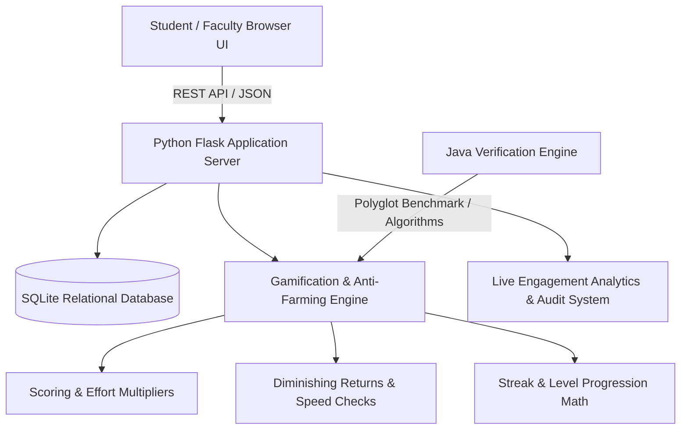

# Implementation Plan: QuestAcademy - Gamified Student Learning Platform

A comprehensive, transparent, RPG-styled gamified learning ecosystem designed to turn learning activity into sustained student engagement and consistent effort rather than just final marks.

## System Architecture Overview



---

## Key Design Decisions & Core Capabilities

### 1. Transparent Progression & Points Engine
- **XP vs. Gold Economy**: 
  - **XP (Experience Points)**: Non-spendable, determines Level and Tier status (Novice $\rightarrow$ Grandmaster). Formula: $\text{Level} = \lfloor \sqrt{\text{XP}/100} \rfloor + 1$.
  - **Gold / Gems (Reward Currency)**: Earned through quality completions and daily quests, spendable in the Avatar & Perks Reward Shop (Streak Freezes, Custom Titles, Avatar Borders).
- **Effort-Driven Scoring Multipliers**:
  - **Streak Multiplier**: Up to $+50\%$ bonus for maintaining active daily learning streaks.
  - **First-Try Mastery Bonus**: Extra $+25\%$ for solving without hints.
  - **Step-by-Step Reflection Bonus**: Points awarded for submitting concise explanations of solutions.

### 2. Anti-Point Farming & Abuse Prevention System
- **Speed Run Detection**: Minimum threshold times calibrated per activity (e.g. 5 questions $\geq 15$ seconds minimum). Rapid completion trips the anti-abuse flag, yields 0 XP, and warns the student.
- **Diminishing Returns on Repetition**:
  - Attempt 1: $100\%$ XP & Gold
  - Attempt 2: $50\%$ XP & Gold
  - Attempt 3: $20\%$ XP & Gold
  - Attempt 4+: $0\%$ XP & Gold (Mastery practice only)
- **Daily Activity Soft & Hard Caps**: Prevents botting and unhealthy cramming by capping repetitive task XP at configurable daily limits ($1,000\text{ XP/day}$).
- **Cooldown Decay**: Rapid successive restarts trigger a temporary cooldown on reward yields.

### 3. Rich Learning Activities (Deliverables)
1. **Interactive Knowledge Duel / Flashcard Sprint**:
   - Timed multiple-choice questions with streak combo meters, instant feedback explanations, and accuracy multipliers.
2. **Code Quest Arena / Algorithmic Sandbox**:
   - Interactive coding environment (Python / JavaScript / Java) with test case execution, step-by-step debugger/hint system, and automated syntax/logic verification.
3. **Concept Lab & Bug Hunter**:
   - Spot the logic flaw in code snippets with immediate visual diffing and reward points.

### 4. Leaderboards & Cohorts
- **Individual Leaderboard**: Real-time filtering by Weekly, Monthly, and All-Time with rank change indicators ($\uparrow 3, \downarrow 1$) and podium animations.
- **Batch / Cohort Leaderboard**: Team-based scoring (Batch CS-2026-A vs. CS-2026-B) based on Average Learning Velocity and Collective Quest contribution.

### 5. Student Progress Profile
- **Player HUD Card**: Level badge, tier title, active equipped cosmetics.
- **Skill Radar / Mastery Matrix**: Visual 5-axis chart (Algorithms, Data Structures, Web Systems, Problem Solving, Consistency).
- **Activity Heatmap**: 52-week GitHub-style contribution grid displaying daily effort intensity.
- **Badge Showcase**: 20+ collectible badges across 4 tiers (Bronze, Silver, Gold, Mythic) with unlocking criteria and timestamp.
- **Streak Tracker & Flame Animations**: Current and best streak with Streak Freeze safeguard slots.

### 6. Faculty / Admin Command Center
- **Scoring & Rule Configuration**: Live sliders to tune Base XP, Streak Multipliers, Daily Caps, and Diminishing Return decay rates without code changes.
- **Anti-Farming Audit Dashboard**: Real-time log of suspicious / flagged attempts with manual review or automatic mitigation overrides.
- **Quest & Challenge Creator**: WYSIWYG form to create new daily/weekly quests and coding challenges with custom test cases.
- **Engagement Analytics**: Interactive chart visualizations showing Active Daily Users (DAU), retention velocity, before-and-after gamification impact metrics.

### 7. Game-Like Audio-Visual Aesthetic
- **Cyber-RPG Neon & Glassmorphism Theme**: Obsidian dark mode with neon cyan, electric purple, and amber accents.
- **Web Audio API Synth Engine**: 100% self-contained audio effects (no broken external MP3 links) for button hover, correct answers, quest claim fanfare, level-up explosions, and error alerts.
- **Particle & Confetti FX**: Dynamic canvas particle effects on level ups and mythic badge unlocks.
- **Interactive 1-Click Guided Demo Mode**: A live demo controller allowing judges to simulate 7-day student activity, level up, trigger anti-farming limits, and inspect analytics instantly.

---

## User Review Required

> [!IMPORTANT]
> **Tech Stack Confirmation**: We will build the platform using **Python (Flask + SQLite)** for the backend & REST API, standard **Java (Java 21)** for high-performance gamification algorithms & test suite, and modern **HTML5, Vanilla CSS3 (Cyber-RPG Design System), and JavaScript (ES6+ with Web Audio & HTML5 Canvas)** for the frontend. No external database server setup or internet connection is required—it runs self-contained out-of-the-box.

---

## Proposed Changes & File Structure

### Backend & Database Layer (`gamified-learning-platform/`)
- `database.py`: SQLite schema initialization, table structures, and seed dataset with 25+ students, 3 batches, 15+ quests, 20+ badges, and realistic historical activity logs.
- `gamification_engine.py`: Core mathematical progression models, XP curve algorithms, streak calculators, and anti-farming heuristics.
- `app.py`: Flask REST API routes serving student HUD, activities, leaderboards, faculty controls, and analytics.
- `gamification_java/`:
  - `GamificationEngine.java`: Pure Java implementation of XP calculations, diminishing returns, and streak evaluation.
  - `ScoringRulesTest.java`: Java test suite validating algorithm consistency.

### Frontend Application Layer (`gamified-learning-platform/static/`, `templates/`)
- `templates/index.html`: Complete Game HUD, Navigation Sidebar, Activity Arena, Leaderboards, Profile Matrix, Faculty Control Room, and Demo Controller.
- `static/css/main.css`: Comprehensive Cyber-RPG design system with CSS custom properties, glassmorphism cards, glowing HUD bars, radar charts, and responsive grid layouts.
- `static/js/audio.js`: Pure Web Audio API synthesizers for level-ups, points chimes, error clicks, and fanfare.
- `static/js/app.js`: Main state manager, navigation controller, notification toasts, and session management.
- `static/js/quizzes.js`: Knowledge Duel / Flashcard Sprint interactive activity runner.
- `static/js/code_quest.js`: Code Arena challenge simulator with test case runner and step hints.
- `static/js/leaderboard.js`: Real-time individual and batch leaderboard renderer with podium animations.
- `static/js/profile.js`: Skill radar canvas renderer, 52-week activity heatmap, badge showcase, and inventory store.
- `static/js/admin.js`: Faculty rule tuner, anti-farming audit inspector, challenge manager, and analytics charts.
- `static/js/demo_runner.js`: 1-Click interactive hackathon demo automation script.

### Verification & Testing
- `test_system.py`: Python unit & integration tests covering scoring calculations, diminishing return rules, speed checks, and API routes.

---

## Verification Plan

### Automated Tests
1. **Python Gamification & Anti-Abuse Test Suite**:
   ```powershell
   python test_system.py
   ```
   - Tests Level calculation from XP.
   - Tests Anti-Farming speed run detection and penalty enforcement.
   - Tests Diminishing returns across 5 consecutive attempts.
   - Tests Streak incrementation and freeze logic.
2. **Java Engine Compilation & Test Suite**:
   ```powershell
   javac gamification_java/GamificationEngine.java gamification_java/ScoringRulesTest.java
   java -cp gamification_java ScoringRulesTest
   ```

### Manual & Interactive Browser Verification
1. Launch Flask web server on `http://127.0.0.1:5000`.
2. Use browser subagent to verify:
   - Initial HUD loading with student avatar, level progress, sound effects, and daily quests.
   - Completing a Quiz activity $\rightarrow$ XP counter animation, audio chime, and point award.
   - Triggering anti-farming (submitting 5 questions in under 2 seconds) $\rightarrow$ Anti-farming warning badge and 0 XP penalty.
   - Solving a Code Quest $\rightarrow$ Test cases pass, XP/Gold reward, and badge unlock modal.
   - Visiting Leaderboards $\rightarrow$ Toggle between Individual, Batch, and Streak views.
   - Visiting Faculty Admin View $\rightarrow$ Modify scoring sliders, view anti-abuse logs, and inspect engagement analytics charts.
   - Running the 1-Click Demo Tour $\rightarrow$ Smooth end-to-end execution.
